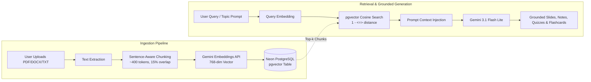

<p align="center">
  
  
  
  
  
  
  
  
</p>

<h1 align="center">🎓 EduWise</h1>

<p align="center">
  <strong>Grounded AI Study Material Generator & Knowledge Hub</strong><br/>
  <em>Turn course materials, textbooks, and notes into presentations, study notes, quizzes, and flashcards with RAG.</em>
</p>

<p align="center">
  <a href="#-features">Features</a> •
  <a href="#-rag-pipeline-architecture">RAG Architecture</a> •
  <a href="#%EF%B8%8F-tech-stack">Tech Stack</a> •
  <a href="#-getting-started">Getting Started</a> •
  <a href="#-testing--verification">Testing & CI</a> •
  <a href="#-project-structure">Project Structure</a>
</p>

<p align="center">
  🚀 <strong>Live App:</strong> <a href="https://eduwise-i8v3.onrender.com/">https://eduwise-i8v3.onrender.com/</a>
</p>

---

## ✨ Features

EduWise is a full-stack study platform that leverages **Google Gemini AI** and **RAG (Retrieval-Augmented Generation)** to produce high-quality, grounded educational content.

### 🧠 Grounded Study Materials with RAG (Flagship)
- **Course Document Ingestion**: Upload lecture notes, PDF textbook chapters, or DOCX documents to your personal Knowledge Base.
- **Sentence-Aware Chunking**: Intelligently splits documents at natural sentence and paragraph boundaries (~400 tokens with 15% overlap).
- **Gemini Embeddings**: Vectorized with 768-dimensional embeddings via Google Gemini's Text Embedding API (0 MB memory overhead, optimized for Render free tier).
- **In-Database Vector Search (`pgvector`)**: Cosine distance similarity search directly inside Neon PostgreSQL.
- **Strict Multi-Tenant Isolation**: Query-scoped to the authenticated user's ID to prevent cross-user data leakage.
- **Source Attribution**: Highlights exactly which uploaded document was used to generate each quiz, flashcard deck, explanation, and summary.

### 📊 AI-Generated Presentations (PPTX)
- Generate complete slide decks with a single prompt or grounded in your uploaded materials.
- AI-driven dynamic theming — colors, fonts, and layout are automatically matched to your topic.
- Auto-fetched images from Google Custom Search for every slide.
- Full customization: slide count (3–10), intro/thank-you slides, dark/light themes, color overrides, serif/sans-serif fonts, and custom visual instructions.

### 📄 AI-Generated Study Notes (PDF)
- Comprehensive, multi-page study notes rendered as formatted PDFs.
- Markdown-to-PDF pipeline with support for headings, bullet points, code blocks, tables, and visual aid tags.
- Custom typography with four bundled font families (Roboto, Lato, Montserrat, Merriweather).
- Adjustable page count (2–15 pages) with dark mode support.

### 🧩 Smart Quizzes
- Auto-generate multiple-choice quizzes from any topic, uploaded document, or indexed Knowledge Base source.
- Instant scoring with a detailed results breakdown and answer verification.

### 🃏 Interactive Flashcards
- Generate Q&A flashcards from topics or uploaded study documents.
- Flip-card interface with keyboard navigation (`Left`, `Right`, `Space`) for active recall practice.

### 💡 Explain Like a Teacher
- Conversational, warm explanations on any concept using analogies and clear plain English.

### 📝 Text & Document Summarizer
- Distills long text or selected knowledge sources into concise, high-yield summaries.

### 👤 User Accounts & Dashboard
- Full authentication system: signup, login, logout, password reset via email.
- User profile customization: display name, bio, and avatar color.
- Personal dashboard tracking all generated resources, favorites, and knowledge sources.

---

## 🏗️ RAG Pipeline Architecture



---

## ⚙️ Tech Stack

| Layer | Technology |
|-------|-----------|
| **Backend** | Python 3.11+, Flask 3.x |
| **AI Engine** | Google Gemini 3.1 Flash Lite (REST API) |
| **Embeddings & RAG** | Gemini `text-embedding-004` (768-dim) + `pgvector` |
| **Database** | SQLite (local dev) / Neon PostgreSQL with pgvector (production) |
| **ORM & Migrations** | SQLAlchemy + Flask-Migrate (Alembic) |
| **Testing & CI** | PyTest (16 unit & integration tests) + GitHub Actions CI |
| **Containerization** | Docker + Docker Compose / Gunicorn |
| **PDF Generation** | ReportLab |
| **PPTX Generation** | python-pptx |
| **Image Search** | Google Custom Search API |
| **File Storage** | Cloudinary |
| **Email** | Gmail SMTP (password reset) |
| **Security** | Flask-WTF CSRF, Flask-Limiter (rate limiting), Werkzeug password hashing |
| **Scheduler** | Flask-APScheduler |
| **Frontend** | Jinja2 templates, vanilla CSS & JS |

---

## 🚀 Getting Started

### Prerequisites

- **Python 3.11+** installed
- A **Google Gemini API key** ([Get one here](https://aistudio.google.com/app/apikey))
- (Optional) **Google Custom Search API Key + CX ID** for automated slide and note images
- (Optional) **Cloudinary Account** for cloud file persistence
- (Optional) **Gmail App Password** for sending password reset emails

### Installation

1. **Clone the repository:**
   ```bash
   git clone https://github.com/Abhinav-Muralidhar/EduWise.git
   cd EduWise
   ```

2. **Create and activate a virtual environment:**
   ```bash
   python -m venv venv
   # On Windows:
   venv\Scripts\activate
   # On macOS/Linux:
   source venv/bin/activate
   ```

3. **Install dependencies:**
   ```bash
   pip install -r requirements.txt
   ```

4. **Configure environment variables:**
   Copy `.env.example` to `.env` and fill in your keys:
   ```env
   SECRET_KEY=your-super-secret-key-here
   GEMINI_API_KEY=your-gemini-api-key
   CUSTOM_SEARCH_API_KEY=your-google-custom-search-api-key
   CUSTOM_SEARCH_CX_ID=your-google-search-engine-id
   CLOUDINARY_CLOUD_NAME=your-cloud-name
   CLOUDINARY_API_KEY=your-cloudinary-api-key
   CLOUDINARY_API_SECRET=your-cloudinary-api-secret
   MAIL_USERNAME=your-email@gmail.com
   MAIL_PASSWORD=your-gmail-app-password
   ```

5. **Run the application:**
   ```bash
   python run.py
   ```
   The app will be live at `http://127.0.0.1:5000`.

---

## 🧪 Testing & Verification

Run the comprehensive pytest test suite locally:

```bash
pytest tests/ -v
```

Tests verify:
- ✅ Document text extraction across PDF, DOCX, and TXT formats
- ✅ Sentence-aware chunking and overlap consistency
- ✅ Vector cosine similarity and ranking accuracy
- ✅ Multi-tenant user isolation (verifying User A cannot retrieve User B's knowledge chunks)
- ✅ Route access controls, keep-alive monitoring, and document ingestion workflows

---

## 🐳 Docker Containerization

Run EduWise in a container:

```bash
# Build Docker image
docker build -t eduwise .

# Run container
docker run -p 5000:5000 --env-file .env eduwise
```

---

## 📁 Project Structure

```
EduWise/
├── app/
│   ├── __init__.py           # Flask app factory & blueprint registration
│   ├── config.py             # Configuration (env vars, fonts, scheduler)
│   ├── extensions.py         # Flask extensions (DB, CSRF, Limiter, etc.)
│   │
│   ├── models/
│   │   ├── user.py           # User model (auth, profile, password reset)
│   │   ├── resource.py       # Resource model (generated content tracking)
│   │   ├── knowledge_source.py # KnowledgeSource model (RAG documents)
│   │   └── chunk.py          # KnowledgeChunk model with pgvector embedding
│   │
│   ├── routes/
│   │   ├── auth.py           # Signup, Login, Logout, Password Reset, Profile
│   │   ├── dashboard.py      # Dashboard, Downloads, Favorites, Keep-alive
│   │   ├── generation.py     # PPTX, PDF, Quiz, Flashcard, Explain, Summarize (RAG wired)
│   │   └── knowledge.py      # Document upload, listing, and deletion
│   │
│   ├── services/
│   │   ├── gemini.py         # Gemini AI integration (prompting & RAG grounding)
│   │   ├── embeddings.py     # Gemini Text Embeddings service
│   │   ├── chunking.py       # Sentence-aware text chunker
│   │   ├── retrieval.py      # pgvector + SQLite dual vector retrieval
│   │   ├── ingestion.py      # Document ingestion pipeline orchestrator
│   │   ├── pptx_builder.py   # PowerPoint file construction
│   │   ├── pdf_builder.py    # PDF file construction with ReportLab
│   │   ├── email.py          # Gmail SMTP for password reset emails
│   │   └── image_search.py   # Google Custom Search image fetching
│   │
│   ├── utils/
│   │   ├── decorators.py     # @login_required decorator
│   │   ├── text.py           # Text extraction from uploaded files
│   │   ├── colors.py         # Hex ↔ RGB color conversion utilities
│   │   ├── resource_helper.py# Save generated resources to DB + Cloudinary
│   │   └── jobs.py           # Scheduled background tasks
│   │
│   ├── templates/            # Jinja2 HTML templates
│   └── static/               # CSS and static assets
│
├── tests/                    # Pytest test suite (16 unit & integration tests)
├── .github/workflows/        # CI/CD pipelines (GitHub Actions)
├── Dockerfile                # Production Docker container setup
├── .dockerignore             # Docker build ignores
├── requirements.txt          # Python dependencies
└── run.py                    # Application entry point
```

---

## 🔒 Security

EduWise implements industry standard security practices:

- **Multi-tenant RAG isolation**: Strict `user_id` query scoping on all vector retrieval operations
- **Password hashing** with Werkzeug (PBKDF2 + salt)
- **CSRF protection** on all forms via Flask-WTF
- **Rate limiting** on sensitive endpoints (login, signup, generation)
- **Secure session cookies** (HttpOnly, SameSite=Lax, 1-hour expiry)
- **Input validation** and file-type whitelisting for uploads
- **Constant-time password reset** responses (no email enumeration)
- **Token-based password reset** with 1-hour expiration

---
<p align="center">
  <strong>Built by Abhinav M</strong>
</p>
